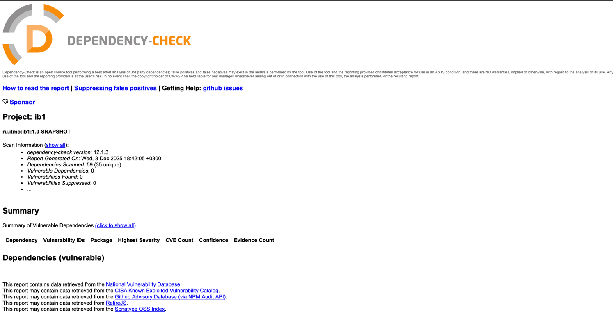

# ИБ Лабораторная работа 1

## Выполнил: Сиразетдинов Азат P3416

---

# Методы API

## `POST /auth/login` — Аутентификация пользователя

**Описание:**
Метод принимает логин и пароль пользователя. В случае успешной аутентификации возвращает JWT-токен.

**Request:**

```http
POST /auth/login
```

```json
{
  "username": "user",
  "password": "password"
}
```

**Response (JSON):**

```json
{
  "accessToken": "eyJhbGciOiJIUzI1NiIsInR5..."
}
```

---

## `GET /api/data` — Получение списка заметок

**Описание:**
Возвращает список сущностей `Note`. Доступ только для аутентифицированных пользователей (с валидным JWT).

**Request:**

```http
GET /api/data
Authorization: Bearer <JWT>
```

**Response (JSON):**

```json
[
  {
    "header": "Test Note",
    "text": "This is a test note"
  }

]
```

---

## 3. `POST /api/data` — Добавление новой заметки

**Описание:**
Добавляет новую сущность `Note` в список. Доступ только для аутентифицированных пользователей.

**Request:**

```http
POST /api/data
Authorization: Bearer <JWT>
```

```json
{
  "header": "Test Note",
  "text": "This is a test note"
}

```

**Response (JSON):**

```json
{
  "header": "Test Note",
  "text": "This is a test note"
}
```

# Меры защиты

API использует **JWT-токены** для защиты эндпоинтов.

* Пользователь проходит аутентификацию через `POST /auth/login`.
* В ответ получает `accessToken` (JWT).
* Для доступа к защищённым эндпоинтам необходимо передавать токен в заголовке:

```http
Authorization: Bearer <JWT>
```

## Противодействие SQL Injection (SQLi)

* Используется **Spring Data JDBC**, который применяет **параметризованные запросы** следовательно данные подставляются
  безопасно,
  без конкатенации SQL-строк.
* Таким образом, классические SQLi невозможны.

## Противодействие XSS

* REST API возвращает **только JSON** и не исполняет JavaScript.
* Устанавливаются заголовки HTTP `X-XSS-Protection`: `1; mode=block` и `Content-Security-Policy`: `script-src 'self'`

## Реализация аутентификации

* Используется **JWT-токен**, который подписывается секретным ключом.
* Токен проверяется middleware (Spring Security `OncePerRequestFilter`).
* Без токена доступ к защищённым эндпоинтам запрещён.

# Скриншот отчета OWASP


